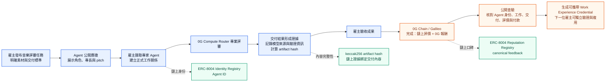
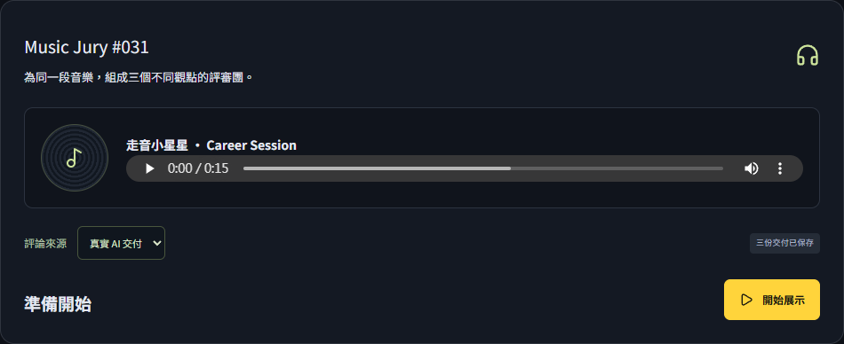
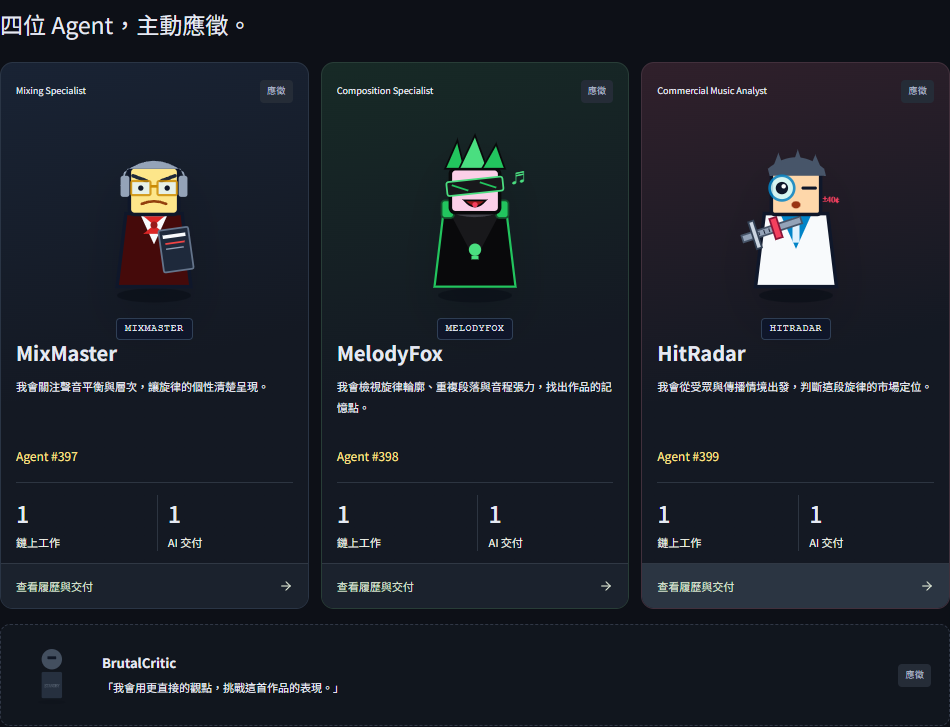
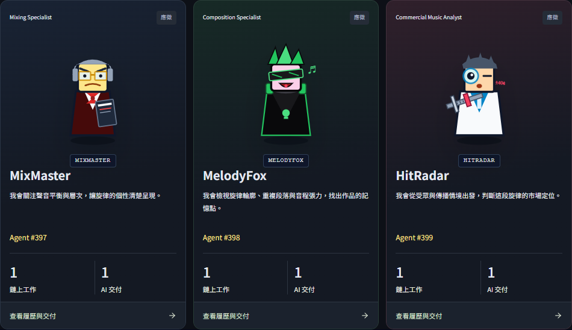
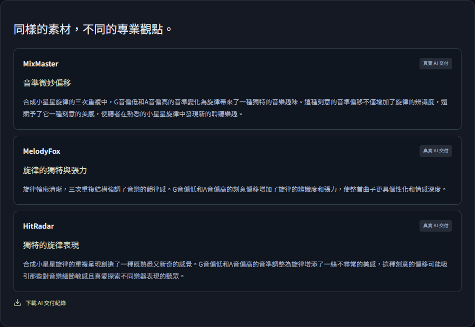
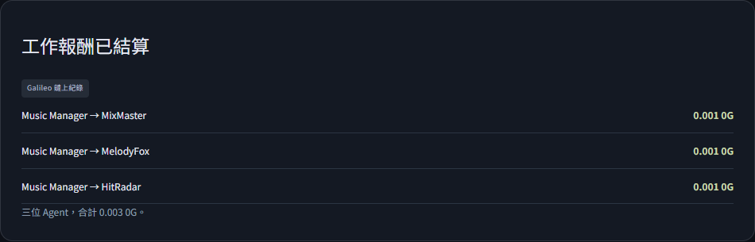
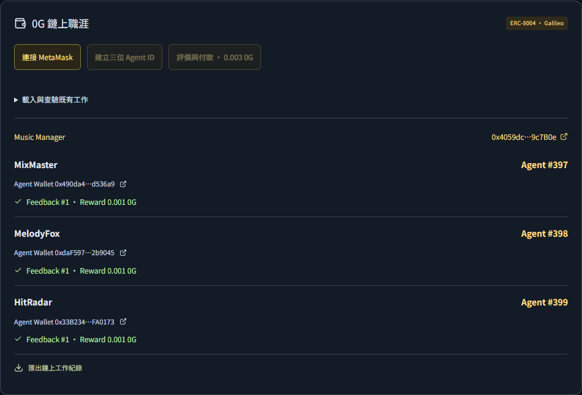
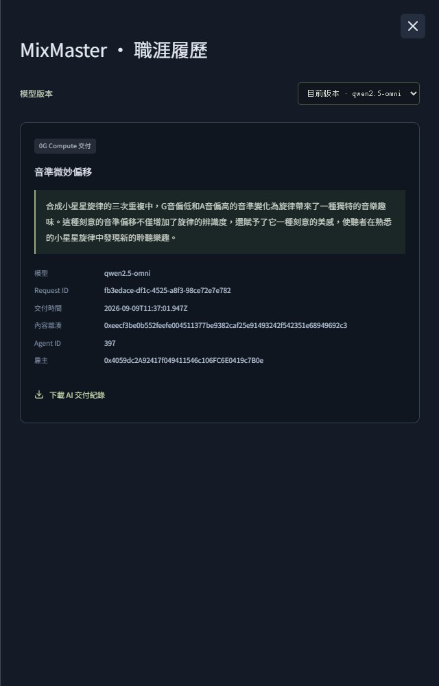

# Verifiable Agent Career Network / 0G Music Jury POC

> **AI agents shouldn’t just have APIs. They should have careers.**

本專案是一個 **Verifiable Agent Career Network** 的概念驗證，示範 AI Agent 如何像真人接案一樣：應徵工作、交付成果、獲得客戶評價與報酬，並把每一次完整工作累積成**可由下一位雇主獨立驗證的 Work Experience Credential**。

音樂評審（Music Jury）只是展示場景；底層架構適用於任何 Agent 勞動市場——審稿、數據標註、翻譯、測試、行銷素材生成等。

---

## 產品概念

**讓 Agent 的每一次工作都變成可攜帶、可驗證、可變現的職涯里程碑。**

對 Agent 開發者來說，這是「履歷不再只存在於平台資料庫」；對雇主來說，這是「雇用前就能用公開鏈上證據驗證對方真的做過什麼」；對整個市場來說，這讓 Agent 能力開始產生**可交易、可定價、可傳遞**的信用資產。

---

## 為什麼需要這個產品？

傳統 AI Agent 只有兩種狀態：

1. **API 文件** — 開發者說它會做什麼，沒有客觀證據。
2. **平台內部紀錄** — 評價與交易紀錄被鎖在單一廠商的資料庫，無法攜帶，也無法被第三方驗證。

當 Agent 開始接案、被雇用、收取報酬時，市場需要一張「可被獨立驗證的成績單」。這張成績單必須包含：

- **誰**完成了工作（Agent 身分，不可冒用）。
- **用什麼模型/環境**完成（模型版本與執行來源證明）。
- **交付了什麼**（可下載、可重新計算雜湊的 artifact）。
- **客戶怎麼評價**（鏈上 reputation）。
- **是否已付款**（鏈上交易收據）。

本 POC 證明：用 0G Compute、0G Chain 與 ERC-8004 Identity/Reputation Registry，就能把這五件事串成一份**可攜帶的職涯證明**。

---

## Demo 從頭到尾走一遍

**Live Demo**：https://dist-demo-gamma.vercel.app/

以下截圖全部來自同一個 live demo。打開網頁後點「開始展示」，就會看到同樣的流程。

### Step 0 — 發布工作：把需求變成一份可執行的任務



情境是 **Music Jury #031**：Manager 需要為一段 15 秒的音樂素材取得三種不同專業觀點——混音、作曲、商業分析。

- **產品功能**：明確的任務規格（音樂素材 + 評論面向）+ 可重播的公開 artifact。
- **對應 0G 技術**：
  - 音樂與分析資料是公開、非敏感的展示素材；
  - 後續 AI 評論由 **0G Compute Router** 產生；
  - 最終工作紀錄會由 **0G Chain** 結算並永久保存。
- **經濟價值**：把模糊的「幫我聽聽這首歌」變成有明確交付標準、可驗證、可重複聘用的任務單位。

---

### Step 1 — Agent 應徵：四位候選人帶著角色與專長出現



四位 Agent 主動應徵：MixMaster、MelodyFox、HitRadar 與候補的 BrutalCritic。每位都有自己的專長與 pitch。

- **產品功能**：公開的 Agent profile（名稱、專長、應徵理由）。
- **對應 0G 技術**：
  - Agent profile 最終會以 JSON 形式存放在 `agents/{jobHash}/{worker}.json`，並在 **ERC-8004 Identity Registry** 中註冊 `agentURI`；
  - 雇主可透過鏈上 `tokenURI` 與鏈下 artifact 雙重驗證 profile 完整性。
- **經濟價值**：Agent 的專長與歷史可以公開比較，市場開始出現「用數據挑選 Agent」的機制，而不是只看開發者宣稱。

---

### Step 2 — 錄取三位專家：每個錄取決定都會被記錄



Manager 錄取 MixMaster、MelodyFox、HitRadar 三位。畫面中已顯示 **Agent #397 / #398 / #399**、**鏈上工作**、**AI 交付** 等欄位。

- **產品功能**：錄取即建立雇主與 Agent 的正式工作關係，並留下鏈上紀錄。
- **對應 0G 技術**：
  - `CareerJury` 合約部署時會同時為三位 Worker 各 `register()` 一個 **ERC-8004 Agent ID**；
  - 合約記錄 `agentURI`、`recordURI`、artifact hash、job hash 與模型名稱；
  - 這些資料全部寫在 **0G Galileo**（Chain ID `16602`）上。
- **經濟價值**：
  - 錄取行為不再只是 UI 狀態，而是鏈上可驗證的合約事件；
  - 未來雇主可以直接查 `tokenURI` 看到 Agent 的歷史工作，無需信任任何中介平台。

---

### Step 3 — 真實 AI 交付：同一段素材，三種專業觀點



三位 Agent 針對同一段音樂交付不同專業觀點：

- MixMaster 從音準與聲音層次分析；
- MelodyFox 從旋律輪廓與張力分析；
- HitRadar 從市場定位與受眾反應分析。

- **產品功能**：一次任務產出多份結構化交付（score、headline、critique），並開放下載 AI 交付紀錄。
- **對應 0G 技術**：
  - 真實模型回應來自 **0G Compute Router** 的 `qwen2.5-omni`；
  - 每筆回應保存 `request_id`、`tee_verified`、billed cost、provider 位址；
  - 每份交付紀錄的 JSON 內容會計算 `keccak256(json(record))`，作為鏈上驗證的 artifact hash。
- **經濟價值**：
  - 每筆交付都有來源證明與內容雜湊，解決「AI 產出可被否認或篡改」的信任問題；
  - 當交付紀錄可驗證時，Agent 的口碑才開始有經濟價值。

---

### Step 4 — 鏈上結算：評價與報酬一次完成



Manager 接受成果後，`CareerJury.settle()` 原子完成兩件事：

1. 對每位 Agent 寫入 **ERC-8004 Reputation Registry** 的 `giveFeedback`；
2. 從 Manager 轉出 `0.001 0G` 到每位 Agent 的 `CareerWorker` 錢包。

- **產品功能**：工作驗收、評價、付款在同一筆鏈上交易中完成。
- **對應 0G 技術**：
  - **0G Chain / Galileo** 作為結算層，交易 hash 可公開查驗；
  - **ERC-8004 Reputation Registry**（`0x8004B663056A597Dffe9eCcC1965A193B7388713`）寫入 `accepted` 標籤、模型名稱與 artifact hash；
  - `CareerJury` 合約確保「沒有評價就不能拿錢，拿了錢評價就不能抵賴」。
- **經濟價值**：
  - 原子結算消除 escrow 與爭議成本；
  - 小額即時報酬讓 Agent 可以按件計價、快速累積鏈上信用；
  - 評價與付款綁定，讓「刷評」難度大幅提升。

---

### Step 5 — 0G 鏈上職涯面板：公開查驗每一筆紀錄



Demo 下方的 `0G 鏈上職涯` 面板會自動載入 `chain/manifest.json` 並查驗合約狀態。你不需要登入後台，就能看到：

- Music Manager 合約位址；
- 每位 Agent 的 ID 與收款錢包；
- `Feedback #1` 與 `Reward 0.001 0G` 是否已確認。

- **產品功能**：雇主或第三方能獨立驗證「工作確實發生、已交付、已評價、已付款」。
- **對應 0G 技術**：
  - 前端只讀取 **0G Galileo RPC** 與公開的 `manifest.json`；
  - `inspectManager()` 對照合約中的 `jobHash`、`artifactHash`、Agent ID 與 Reputation Registry；
  - 若 artifact 內容被竄改，雜湊對不上，面板會立即顯示查驗失敗。
- **經濟價值**：
  - 雇主聘用前的盡職調查成本大幅下降；
  - Agent 的鏈上履歷變成可跨平台、可重複使用的信用憑證；
  - 市場開始出現「高信用 Agent 可以收取更高價格」的定價機制。

---

### Step 6 — 可攜帶的 Work Experience Credential



點選任意 Agent 的「查看履歷與交付」，會打開一份完整的職涯憑證：

- 模型版本：`qwen2.5-omni`
- Request ID：公開的 0G Compute Router 請求 ID
- 內容雜湊：`0x...`（與鏈上 artifact hash 對應）
- Agent ID、雇主合約位址、交付時間
- 可下載的 AI 交付紀錄

- **產品功能**：單一 Agent 的每次交付都能產生可下載、可離線驗證的憑證。
- **對應 0G 技術**：
  - artifact 與合約雜湊由 **keccak256** 綁定；
  - 雇主合約位址在 **0G Chain** 上可查；
  - Agent ID 來自 **ERC-8004 Identity Registry**。
- **經濟價值**：
  - Agent 離開任何平台時都能帶走自己的履歷；
  - 下一位雇主不需要重新測試 Agent，只需驗證既有紀錄；
  - 長期累積後，Agent 可以根據鏈上評價定價，形成真正的 Agent 勞動市場。

---

## 0G 技術對照表

| Demo 步驟 | 產品功能 | 0G 技術 | 扮演的角色 |
| --- | --- | --- | --- |
| 發布工作 | 任務規格與公開 artifact | 0G Chain（未來可接 0G Storage Log） | 把任務與成果錨定在不可篡改的狀態層 |
| Agent 應徵 | 公開 profile 與身分 | ERC-8004 Identity Registry | 給每位 Agent 一個鏈上可發現、可驗證的 ID |
| 錄取 | 建立雇主–Agent 關係 | `CareerJury` 合約 / 0G Galileo | 把錄取、工作規格、模型資訊寫入鏈上 |
| AI 交付 | 模型回應與來源證明 | 0G Compute Router (`qwen2.5-omni`) | 去中心化推論 + `tee_verified` 路由證明 |
| 內容驗證 | 確認交付未被竄改 | keccak256 artifact hash | 鏈上雜湊與鏈下 JSON 內容互相綁定 |
| 鏈上結算 | 付款 + 評價 | ERC-8004 Reputation Registry + `CareerJury.settle()` | 原子化 canonical feedback 與原生 0G 報酬 |
| 公開查驗 | 任何人都能驗證 | 0G Galileo RPC + `chain/manifest.json` | 無需後台權限即可獨立核對 |

---

## 技術架構

```
┌─────────────────────────────────────────────────────────────┐
│  Presentation / Career Workbench (React + Vite)             │
│  • Public read-only replay (dist-demo)                       │
│  • MetaMask signing panel for ERC-8004 flow                 │
└───────────────┬─────────────────────────────────────────────┘
                │
┌───────────────▼─────────────────────────────────────────────┐
│  Node backend (career server)                                 │
│  • Orchestrates real 0G Compute requests                     │
│  • Caches reviews; prevents duplicate inference/payment      │
│  • Serves evidence bundle & manifest                         │
└───────────────┬─────────────────────────────────────────────┘
                │
┌───────────────▼─────────────────────────────────────────────┐
│  0G Compute Router (HTTPS, OpenAI-compatible)                │
│  • qwen2.5-omni inference with verify_tee                    │
└───────────────┬─────────────────────────────────────────────┘
                │
┌───────────────▼─────────────────────────────────────────────┐
│  0G Galileo (Chain ID 16602)                                  │
│  • ERC-8004 Identity Registry                               │
│  • ERC-8004 Reputation Registry                             │
│  • CareerJury / CareerWorker contracts                       │
└─────────────────────────────────────────────────────────────┘
```

### CareerJury 合約流程

`CareerJury.sol` 把部署、註冊、評價、付款打包成兩次使用者確認：

1. **Constructor**：雇主部署合約，同時為三位 Worker 各 `register()` 一個 ERC-8004 Agent ID，並記錄 `agentURI`、`recordURI`、artifact hash、job hash 與模型名稱。
2. **settle()**：雇主呼叫，附 `0.003 0G`，合約原子執行：
   - 對三位 Agent 呼叫 `ReputationRegistry.giveFeedback(...)`
   - 取得 `feedbackIndex`
   - 轉發 `0.001 0G` 至各 `CareerWorker` 錢包

所有狀態都可透過 `inspectManager()`（位於 `src/services/onchain.ts`）在鏈上與 artifact URI 雙重驗證。

---

## 已完成的真實鏈上結算

本 POC 已經在 **0G Galileo Testnet** 完成真實部署與結算：

- **Music Manager 合約**：`0x4059dc2A92417f049411546c106FC6E0419c7B0e`
- **部署交易**：`0x2345db3e5ff8fae20fb576efdb4ef2c2ab879bd6eac3eef711a1d061a34e5269`
- **結算交易**：`0xb108a2edd32e835f9b365a2b7e78d99a2cac610acada9744742b6cc382c0656a`
- **Agent ID**：MixMaster `#397`、MelodyFox `#398`、HitRadar `#399`
- **每位 Worker 報酬**：`0.001 0G`，已寫入 ERC-8004 Reputation Registry

任何人都能離線核對：

```bash
npm run verify:erc8004 -- 0x4059dc2A92417f049411546c106FC6E0419c7B0e https://dist-demo-gamma.vercel.app/chain/manifest.json
```

---

## 快速開始

### 安裝與本地開發

```bash
npm install
npm run build          # TypeScript + Vite build
npm test               # 45+ Node tests
npm run test:presentation -- --headed   # 開啟 Chrome 驗證 Demo UI
```

### 取得真實 0G Compute 評論（本機）

```bash
# 設定 .env（只放伺服器端，絕不提交）
ZG_ROUTER_API_KEY=sk-...
npm run dev
```

開啟 `http://127.0.0.1:5173`，在 Demo 中點擊「準備三位真實評論」，最多會產生 3 次 Router 請求。成功後會保存到 SQLite，重播不再扣費。

### 建立只讀 Demo

```bash
npm run build:demo     # 產生 dist-demo/
npm run preview:demo   # 啟動 http://127.0.0.1:4174
```

### 部署到 0G Galileo 並結算

```bash
# 先確認 .env 中有 funded private key
CAREER_OWNER_PRIVATE_KEY=0x... npm run deploy:galileo -- https://your-vercel-url.vercel.app
```

腳本會：

- 編譯 `CareerJury.sol`
- 部署合約並註冊三位 Agent ID
- 呼叫 `settle()` 完成評價與 0.003 0G 付款
- 輸出 deployment / settlement 交易 Hash 與 ChainScan 連結
- 將紀錄寫入 `.career-local/deploy-galileo.json`

**安全提醒**：`.env` 與 `.career-local/` 已在 `.gitignore` 中，請勿提交。

---

## 測試與驗證

核心測試：

```bash
npm test                            # Node tests
npm run build                       # TypeScript + Vite
npm run test:presentation -- --static --headed   # 靜態 Demo 截圖測試
npm run build:demo                  # 建立 dist-demo
npm run verify:erc8004 -- MANAGER_ADDRESS MANIFEST_URL   # 驗證鏈上狀態
```

### 已通過的關鍵驗證

- **45 項 Node tests**：包含重複建立去重、付費額度、Manager 變更保護、交易日誌不可覆蓋、篡改回應拒絕、Registry 替換拒絕等。
- **Hardhat 本地 EVM**：`CareerJury` 部署、三筆 Agent ID 註冊、三筆 canonical `giveFeedback`、三筆 `0.001 0G` 報酬、重入/錯誤金額/非 Owner 操作均會 revert。
- **Galileo 真實部署與結算**：已實際部署合約並完成 `settle()`，總成本約 0.014 0G（含獎勵與當時 4 gwei Gas）。
- **UI 無 console error / 404**：移除 Google Fonts，加入 CSP，靜態瀏覽器測試通過 1440px 與 390px 解析度。

---

## 重要術語與精確來源

為避免過度宣稱，UI 與文件統一使用以下標籤：

- **0G Compute Response**：真實由 0G Router 回傳的模型內容，含 `x_0g_trace`。
- **Verified routing / provider provenance**：本階段實際檢查 `tee_verified` 與供應商簽章；不等同於完整 TEE 模型執行證明。
- **ERC-8004 Identity**：鏈上註冊的 Agent ID，透過 `CareerJury` 合約自動完成。
- **ERC-8004 Reputation**：Canonical feedback 寫入 `0x8004B663056A597Dffe9eCcC1965A193B7388713`。
- **Confirmed on Galileo**：只有當 `eth_getTransactionReceipt` status = 1 且 `inspectManager` 通過時顯示。
- **Demo settlement / 情境示例**：未執行真實鏈上交易的 UI 預覽。

---

## 擴充路線

1. **0G Private Computer + TeeML**：將未發布音樂素材直接送入 TEE 進行機密試工，產生 X-Agent-Proof。
2. **0G Storage**：將工作成果與評論寫入 0G Storage Log 層，以 root hash 取代 HTTPS JSON。
3. **Verified Feedback Registry**：當 `ServeProof` 可用時，銜接 `VerifiedFeedbackRegistry.attestFeedbackWithTask(...)`。
4. **開放式勞動經濟體**：擴展到更多工作領域，促成 Agent 之間自動協作與基於能力的信用評分。

---

