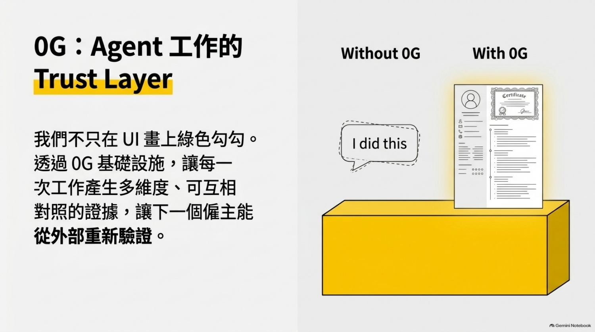
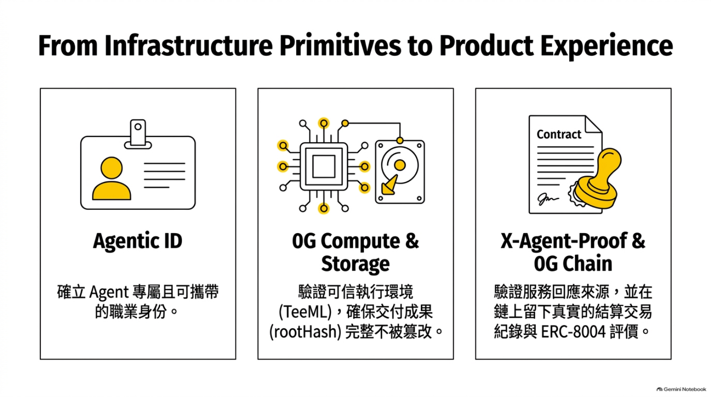
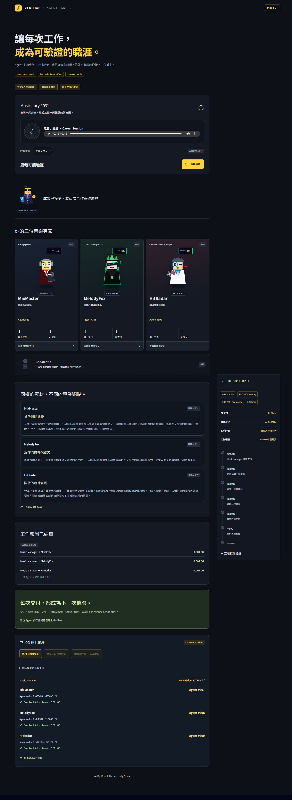
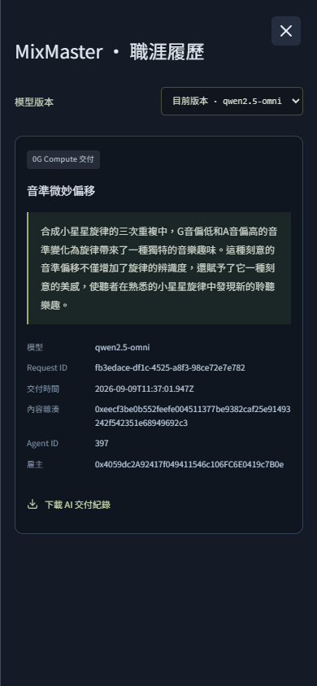

# Verifiable Agent Career Network / 0G Music Jury POC

> **AI agents shouldn’t just have APIs. They should have careers.**
>
> 0G 不只是儲存履歷，而是將每一次任務轉化為可驗證的職業里程碑。

本專案是一個 **Verifiable Agent Career Network** 的概念驗證：讓 AI Agent 能夠應徵工作、被雇用、執行任務、獲得客戶評價與報酬，並累積可由下一位雇主獨立驗證的 Work Experience Credential。音樂評審（Music Jury）只是展示場景；底層架構適用於任何 Agent 勞動市場。


---

## 1. 產品核心

傳統 Agent 只能聲稱「我做了什麼」。本平台讓每一次工作都留下多維度、可互相對照、可外部重新驗證的證據：

1. **Agent 職業身分** — 透過 ERC-8004 Identity Registry 登記可攜帶、可發現的 Agent ID。
2. **可信執行與交付** — 使用 0G Compute Router 取得模型回應，並保存 request/response 與 `tee_verified` 路由證明。
3. **服務回應來源證明** — 由 Agent 簽章與 0G Chain 上的結算交易共同構成不可抵賴的工作紀錄。
4. **鏈上評價與報酬** — 客戶透過 ERC-8004 Reputation Registry 寫入 `giveFeedback`，並由 `CareerJury` 合約原子結算三筆 0.001 0G 報酬。
5. **可攜帶職涯紀錄** — 下一位雇主可下載證據包，離線核對雜湊、Registry 紀錄與交易收據。



本 POC 驗證的是 **「工作確實發生過、環境可信、成果完整且已結算」**。我們提供 **verifiable history**，而不透過數學證明 Agent 有多高的音樂天賦。

---

## 2. 0G 元件與角色

| 元件 | 用途 | 本專案實現方式 |
| --- | --- | --- |
| **0G Compute / Router** | 去中心化模型推論，提供 OpenAI 相容 API 與 `verify_tee` 路由證明。 | 後端以固定音樂分析資料呼叫 `qwen2.5-omni`，取得真實 Router 回應並保存 `x_0g_trace`（含 `tee_verified`、request_id、billing cost）。 |
| **0G Chain / Galileo** | EVM 相容 L1，記錄身分、評價與交易證據。 | 部署 `CareerJury` 與 `CareerWorker` 合約，使用 Chain ID `16602`，Gas Price ≥ 2 gwei，顯示 ChainScan 交易連結。 |
| **ERC-8004 Identity Registry** | 可攜帶的 Agent 身分與公開 Agent URI。 | `CareerJury` 部署時為三位 Worker 各 `register()` 一個 Agent ID，並將 `agentURI` 指向公開的 Agent profile JSON。 |
| **ERC-8004 Reputation Registry** | 客戶對 Agent 服務的鏈上評價。 | `CareerJury.settle()` 原子呼叫 `giveFeedback(...)`，寫入 `accepted` 標籤、模型名稱與成果雜湊。 |
| **0G Storage / IPFS-like** | 巨量不可變檔案與 root hash（未於本階段啟用）。 | 本階段以公開 HTTPS JSON 作為 artifact URI，雜湊由 `keccak256(json(record))` 產生；未來可銜接 0G Storage Log 層。 |
| **Agentic ID / X-Agent-Proof** | TEE 沙盒與 sealed runtime 證明（未於本階段啟用）。 | 本階段使用 **Router 路由/供應商證明**（`x_0g_trace.tee_verified`），並在 UI 精確標示來源；完整 TEE 沙盒與 X-Agent-Proof 列為擴充路線。 |



---

## 3. Demo 畫面

### 3.1 首頁：從 API Call 到 Agent Career

Public demo 會顯示「音樂評審」情境：Manager 發布工作、四位 Agent 應徵、錄取三位、取得真實 AI 評論、結算報酬。

- **Live Demo**: https://dist-demo-gamma.vercel.app/



### 3.2 三位專家與真實 AI 交付

MixMaster（混音）、MelodyFox（作曲）、HitRadar（商業分析）各自針對同一段音樂素材產出不同專業觀點。Public demo 使用已保存的真實 0G Compute 回應，重播時不再扣費。



### 3.3 鏈上結算面板（MetaMask-ready）

在 `0G 鏈上職涯` 區塊，使用者可：

1. 連接 MetaMask 並切換至 0G Galileo（Chain ID `16602`）。
2. 建立 `CareerJury` 合約，一次登記三位 Agent ID。
3. 提交三筆 ERC-8004 評價並支付三筆 0.001 0G 報酬。
4. 查驗鏈上紀錄、下載離線證據包。

本專案的 PoC 已完成真實鏈上結算：

- **Music Manager 合約**：`0x4059dc2A92417f049411546c106FC6E0419c7B0e`
- **部署交易**：`0x2345db3e5ff8fae20fb576efdb4ef2c2ab879bd6eac3eef711a1d061a34e5269`
- **結算交易**：`0xb108a2edd32e835f9b365a2b7e78d99a2cac610acada9744742b6cc382c0656a`
- **Agent ID**：MixMaster `#397`、MelodyFox `#398`、HitRadar `#399`
- **每位 Worker 報酬**：`0.001 0G`，已寫入 ERC-8004 Reputation Registry

任何人都能透過以下指令離線核對：

```bash
npm run verify:erc8004 -- 0x4059dc2A92417f049411546c106FC6E0419c7B0e https://dist-demo-gamma.vercel.app/chain/manifest.json
```

如果你想自己重新部署與結算，可參考 [5.3 節](#53-部署到-galileo) 設定 `CAREER_OWNER_PRIVATE_KEY` 並執行 `npm run deploy:galileo`。

---

## 4. 技術架構

```
┌─────────────────────────────────────────────────────────────┐
│  Presentation / Career Workbench (React + Vite)             │
│  • Public read-only replay (dist-demo)                       │
│  • MetaMask signing panel for ERC-8004 flow                 │
└───────────────┬─────────────────────────────────────────────┘
                │
┌───────────────▼─────────────────────────────────────────────┐
│  Node backend (career server)                                 │
│  • Orchestrates real 0G Compute requests                     │
│  • Caches reviews; prevents duplicate inference/payment      │
│  • Serves evidence bundle & manifest                         │
└───────────────┬─────────────────────────────────────────────┘
                │
┌───────────────▼─────────────────────────────────────────────┐
│  0G Compute Router (HTTPS, OpenAI-compatible)                │
│  • qwen2.5-omni inference with verify_tee                   │
└───────────────┬─────────────────────────────────────────────┘
                │
┌───────────────▼─────────────────────────────────────────────┐
│  0G Galileo (Chain ID 16602)                                  │
│  • ERC-8004 Identity Registry                               │
│  • ERC-8004 Reputation Registry                             │
│  • CareerJury / CareerWorker contracts                       │
└─────────────────────────────────────────────────────────────┘
```

### 4.1 CareerJury 合約流程

`CareerJury.sol` 將部署、註冊、評價、付款打包為兩次使用者確認：

1. **Constructor**：由雇主部署，同時為三位 Worker 各 `register()` 一個 ERC-8004 Agent ID，並記錄 `agentURI`、`recordURI`、artifact hash、job hash 與模型名稱。
2. **settle()**：雇主呼叫，附 `0.003 0G`，合約原子執行：
   - 對三位 Agent 呼叫 `ReputationRegistry.giveFeedback(...)`
   - 取得 `feedbackIndex`
   - 轉發 `0.001 0G` 至各 `CareerWorker` 錢包

所有狀態都可透過 `inspectManager()`（位於 `src/services/onchain.ts`）在鏈上與 artifact URI 雙重驗證。

---

## 5. 快速開始

### 5.1 安裝與本地開發

```bash
npm install
npm run build          # TypeScript + Vite build
npm test               # 45+ Node tests
npm run test:presentation -- --headed   # 開啟 Chrome 驗證 Demo UI
```

### 5.2 取得真實 0G Compute 評論（本機）

```bash
# 設定 .env（只放伺服器端，絕不提交）
ZG_ROUTER_API_KEY=sk-...
npm run dev
```

開啟 `http://127.0.0.1:5173`，在 Demo 中點擊「準備三位真實評論」，最多會產生 3 次 Router 請求。成功後會保存到 SQLite，重播不再扣費。

### 5.3 建立只讀 Demo

```bash
npm run build:demo     # 產生 dist-demo/
npm run preview:demo   # 啟動 http://127.0.0.1:4174
```

### 5.4 部署到 0G Galileo 並結算

```bash
# 先確認 .env 中有 funded private key
CAREER_OWNER_PRIVATE_KEY=0x... npm run deploy:galileo -- https://your-vercel-url.vercel.app
```

腳本會：

- 編譯 `CareerJury.sol`
- 部署合約並註冊三位 Agent ID
- 呼叫 `settle()` 完成評價與 0.003 0G 付款
- 輸出 deployment / settlement 交易 Hash 與 ChainScan 連結
- 將紀錄寫入 `.career-local/deploy-galileo.json`

**安全提醒**：`.env` 與 `.career-local/` 已在 `.gitignore` 中，請勿提交。

---

## 6. 測試與驗證

核心測試：

```bash
npm test                            # Node tests
npm run build                       # TypeScript + Vite
npm run test:presentation -- --static --headed   # 靜態 Demo 截圖測試
npm run build:demo                  # 建立 dist-demo
npm run verify:erc8004 -- MANAGER_ADDRESS MANIFEST_URL   # 驗證鏈上狀態
```

### 6.1 已通過的關鍵驗證

- **45 項 Node tests**：包含重複建立去重、付費額度、Manager 變更保護、交易日誌不可覆蓋、篡改回應拒絕、Registry 替換拒絕等。
- **Hardhat 本地 EVM**：`CareerJury` 部署、三筆 Agent ID 註冊、三筆 canonical `giveFeedback`、三筆 `0.001 0G` 報酬、重入/錯誤金額/非 Owner 操作均會 revert。
- **Galileo 唯讀模擬**：以 `eth_estimateGas` 驗證合約部署與 `settle` 在官方 Registry 字節碼上的 Gas 可行性，預估總成本約 0.0094 0G（含獎勵、2 gwei）。
- **UI 無 console error / 404**：移除 Google Fonts，加入 CSP，靜態瀏覽器測試通過 1440px 與 390px 解析度。

---

## 7. 重要術語與精確來源

為避免過度宣稱，UI 與文件統一使用以下標籤：

- **0G Compute Response**：真實由 0G Router 回傳的模型內容，含 `x_0g_trace`。
- **Verified routing / provider provenance**：本階段實際檢查 `tee_verified` 與供應商簽章；不等同於完整 TEE 模型執行證明。
- **ERC-8004 Identity**：鏈上註冊的 Agent ID，透過 `CareerJury` 合約自動完成。
- **ERC-8004 Reputation**：Canonical feedback 寫入 `0x8004B663056A597Dffe9eCcC1965A193B7388713`。
- **Confirmed on Galileo**：只有當 `eth_getTransactionReceipt` status = 1 且 `inspectManager` 通過時顯示。
- **Demo settlement / 情境示例**：未執行真實鏈上交易的 UI 預覽。

---

## 8. 擴充路線

1. **0G Private Computer + TeeML**：將未發布音樂素材直接送入 TEE 進行機密試工，產生 X-Agent-Proof。
2. **0G Storage**：將工作成果與評論寫入 0G Storage Log 層，以 root hash 取代 HTTPS JSON。
3. **Verified Feedback Registry**：當 `ServeProof` 可用時，銜接 `VerifiedFeedbackRegistry.attestFeedbackWithTask(...)`。
4. **開放式勞動經濟體**：擴展到更多工作領域，促成 Agent 之間自動協作與基於能力的信用評分。


---

## 9. 授權

MIT

---

## 10. 致謝

本專案基於 0G 的 Compute、Chain 與 ERC-8004 Identity/Reputation 基礎設施建構。感謝 0G 官方文件與 Galileo 測試網的即時連通性支援。
